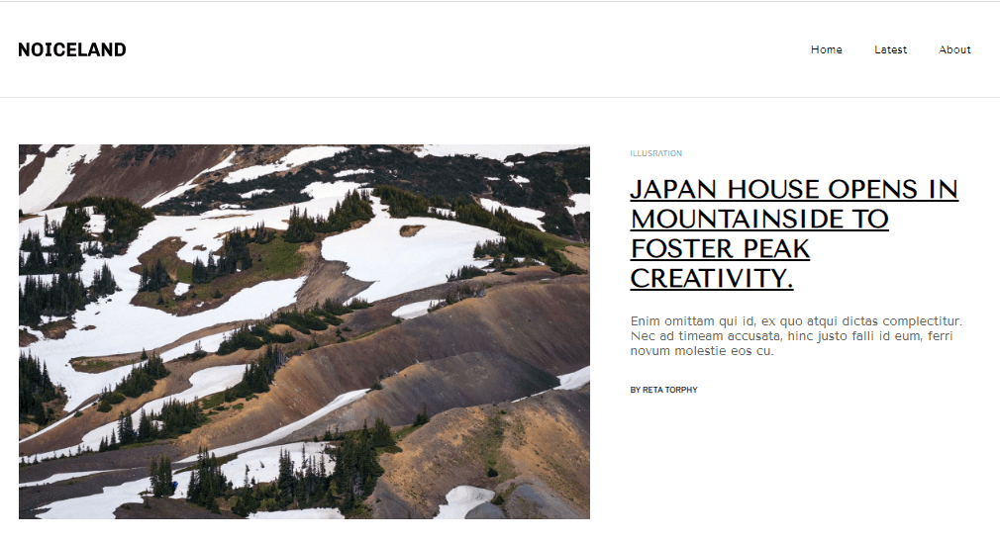

# Blog Noiceland+ #

Cтраница страница блога по макет Figma, с использованием flex-box и Grid-layout для размещения блоков с фото на странице, формы с введением email, и анимации по наведению курсора

[Посмотреть на Github Pages](https://anastasia-andrushkevich.github.io/Noiceland/)

Исходный макет [Figma](https://www.figma.com/file/10NCr58WRzeNLOLwZ56uPY/Noiceland-%2B?node-id=0%3A1&t=msk65JpJr3cVvNL7-0)